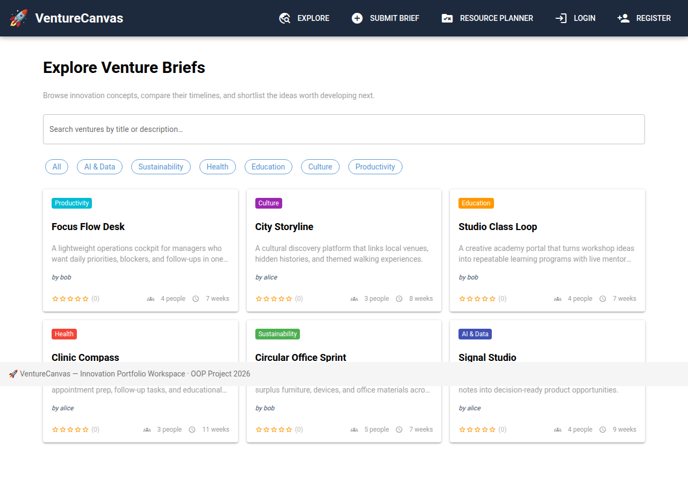
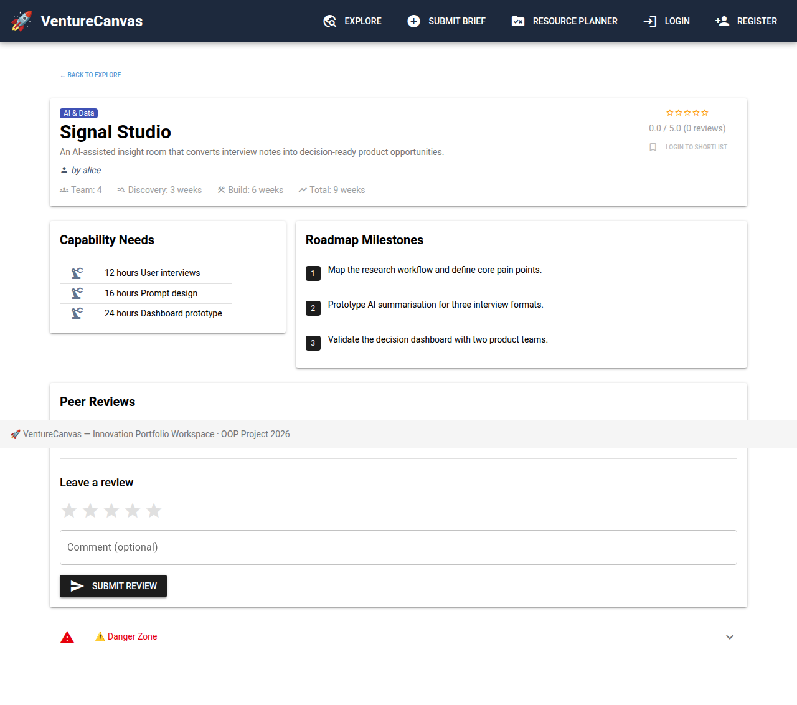
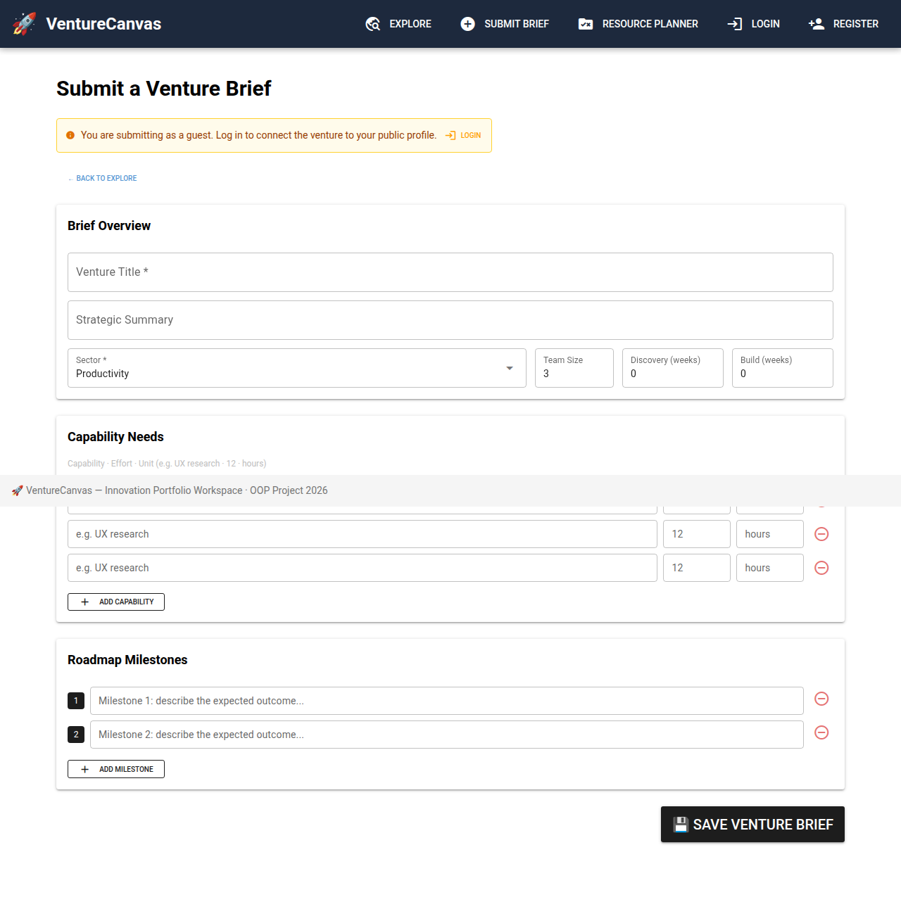

# 🚀 VentureCanvas — Innovation Portfolio Workspace

> **BSc WI — Objektorientierte Programmierung 1 · Group Project 2026**

VentureCanvas is a browser-based **innovation portfolio and venture brief platform** built with **NiceGUI**, **SQLAlchemy** (ORM), and **SQLite**. Users can register, publish professional concept briefs, define capability needs and roadmap milestones, shortlist promising ideas, and review ventures from the community.

---

## Why VentureCanvas?

A recipe app may demonstrate CRUD, but it does not communicate a strong professional project identity. VentureCanvas is designed as a more credible and creative OOP semester project: a place where teams can document product ideas, startup concepts, service innovations, or transformation initiatives in a structured, browser-based workspace.

It solves a realistic problem: **capturing early-stage venture ideas in a way that is searchable, collaborative, and presentation-ready**.

---

## 📸 Screenshots

| Explore | Venture Detail |
|---|---|
|  |  |

| Submit Brief | Profile |
|---|---|
|  |  |

---

## ✨ Features

| Feature | Description |
|---|---|
| 👤 **User accounts** | Register with username, email, password, and a professional bio |
| 🔐 **Login / Logout** | Session is stored in encrypted browser cookies via NiceGUI storage |
| 🧾 **Venture briefs** | Create structured innovation briefs with title, summary, sector, timeline, and team size |
| 🧰 **Capability planning** | Define resource needs such as UX research, prompt design, or compliance effort |
| 🗺️ **Roadmap milestones** | Capture ordered milestones that describe the venture delivery path |
| 🔍 **Search** | Search venture briefs by title or description |
| 🏷️ **Sector filter** | Filter by AI & Data, Sustainability, Health, Education, Culture, or Productivity |
| ⭐ **Peer reviews** | Submit a 1–5 score and optional written feedback for any venture brief |
| 📌 **Shortlists** | Save promising ventures to your personal shortlist |
| 👤 **Public profiles** | Every user has a profile showing authored ventures and, privately, their shortlist |
| 🧮 **Resource planner** | Aggregate capability needs across multiple ventures into one planning view |
| 🗑️ **Delete brief** | Remove venture briefs and all dependent data |

---

## 🏗️ Architecture

The application follows the three-layer architecture required by the module:

```
┌────────────────────────────────────────────────────┐
│  Presentation Layer (Thin Client)                  │
│  Browser — renders Vue.js / Quasar components      │
└──────────────────────┬─────────────────────────────┘
                       │  WebSocket (NiceGUI)
┌──────────────────────▼─────────────────────────────┐
│  Application Logic (Server-side Frontend)          │
│  NiceGUI pages + Python OOP service classes        │
│  app/views/   <->   app/services/                  │
└──────────────────────┬─────────────────────────────┘
                       │  SQLAlchemy ORM
┌──────────────────────▼─────────────────────────────┐
│  Persistence Layer                                 │
│  SQLite database  ·  app/models/                   │
└────────────────────────────────────────────────────┘
```

### Project structure

```
Advanced-Programming/
├── main.py
├── requirements.txt
├── app/
│   ├── models/
│   │   ├── database.py
│   │   ├── user.py
│   │   ├── venture.py
│   │   ├── resource_need.py
│   │   ├── milestone.py
│   │   ├── review.py
│   │   └── shortlist.py
│   ├── services/
│   │   ├── user_service.py
│   │   ├── venture_service.py
│   │   └── review_service.py
│   ├── views/
│   │   ├── shared.py
│   │   ├── auth.py
│   │   ├── home.py
│   │   ├── venture_detail.py
│   │   ├── add_venture.py
│   │   ├── profile.py
│   │   └── resource_planner.py
│   └── seed.py
├── docs/
└── tests/
```

---

## 🗄️ Data Model

```
User
  ├── id, username, email, password_hash, bio, created_at
  ├── ── Venture   (authored venture briefs) [1 → *]
  └── ── Shortlist (saved ventures)          [1 → *]

Venture
  ├── id, title, description, sector, team_size
  ├── discovery_weeks, build_weeks, created_at
  ├── user_id (FK → User, nullable)
  ├── ── ResourceNeed (capability, effort, unit) [1 → *]
  ├── ── Milestone    (number, description)      [1 → *]
  ├── ── Review       (score, comment)           [1 → *]
  └── ── Shortlist    (saved references)         [1 → *]
```

All relationships use **cascade delete** where appropriate.

---

## 📚 Libraries Used

| Library | Version | Purpose |
|---|---|---|
| [NiceGUI](https://nicegui.io/) | >= 2.0 | Browser-based UI built in pure Python |
| [SQLAlchemy](https://www.sqlalchemy.org/) | >= 2.0 | ORM — no raw SQL; all persistence goes through model classes |
| SQLite (stdlib) | — | Embedded relational database |
| hashlib (stdlib) | — | PBKDF2-HMAC-SHA256 password hashing |
| pytest | >= 7.0 | Automated tests for model and service logic |

---

## 🚀 Getting Started

### 1. Install dependencies

```bash
pip install -r requirements.txt
```

### 2. Run the application

```bash
python main.py
```

The server starts at **http://localhost:8080**. On first run, the database is created and seeded with **2 demo users** and **6 sample venture briefs** automatically.

### Demo accounts

| Username | Password |
|---|---|
| `alice` | `alice123` |
| `bob` | `bob12345` |

---

## 👤 User Stories

| ID | As a … | I want to … | So that … |
|---|---|---|---|
| US-1 | visitor | register an account | I can build a professional innovation profile |
| US-2 | visitor | log in with my username and password | I can manage my own venture portfolio |
| US-3 | user | create a venture brief | I can document an idea in a structured way |
| US-4 | user | define capability needs | I can estimate what resources the idea requires |
| US-5 | user | add roadmap milestones | I can communicate how the concept could be delivered |
| US-6 | visitor | browse all ventures | I can discover ideas from other users |
| US-7 | visitor | filter ventures by sector | I can focus on topics relevant to me |
| US-8 | visitor | search venture titles and summaries | I can find promising concepts quickly |
| US-9 | user | shortlist a venture | I can save concepts I want to revisit later |
| US-10 | user | review a venture | I can provide peer feedback on its quality or feasibility |
| US-11 | user | view a profile page | I can see authored ventures and track my public presence |
| US-12 | user | aggregate capability needs across ventures | I can create a lightweight planning overview |

---

## 📐 Use Cases

### UC-1: Register & Login
- **Actor**: New visitor
- **Flow**: Open `/register` → enter username, email, password, and bio → account created and logged in → redirected to the explore page

### UC-2: Create a Venture Brief
- **Actor**: Logged-in user
- **Flow**: Open `/submit` → fill overview, capability needs, and roadmap milestones → save → redirected to `/venture/{id}`

### UC-3: Review and Shortlist a Venture
- **Actor**: Logged-in user
- **Flow**: Open a venture detail page → optionally click **Shortlist** → select review score and comment → submit feedback

### UC-4: Use the Resource Planner
- **Actor**: Any user
- **Flow**: Open `/planner` → select multiple venture briefs → click **Generate Plan** → aggregated capability needs are shown

### UC-5: View and Edit Profile
- **Actor**: Logged-in user
- **Flow**: Open `/profile/<username>` → review authored ventures and shortlist → edit bio in the inline form

---

## 👥 Team & Work Distribution

| Member | Responsibility |
|---|---|
| Member 1 | Data models (`app/models/`), database setup, schema migration support, seed data |
| Member 2 | Service layer (`app/services/`) for authentication, venture CRUD, reviews, and shortlist logic |
| Member 3 | NiceGUI views (`app/views/`), reusable layout components, README, screenshots, and demo flow |

> Every team member should contribute directly through GitHub commits, pull requests, issue tracking, and documentation updates so the contribution history remains visible for assessment.

---

## 🗓️ Milestones

| Milestone | Target | Status |
|---|---|---|
| Project setup & data models | Week 3 | ✅ |
| Service layer & CRUD operations | Week 5 | ✅ |
| NiceGUI views & navigation | Week 8 | ✅ |
| Reviews, shortlists, and planner | Week 10 | ✅ |
| Documentation & presentation prep | Week 12 | ✅ |
| Final presentation | Last week | ⏳ |
