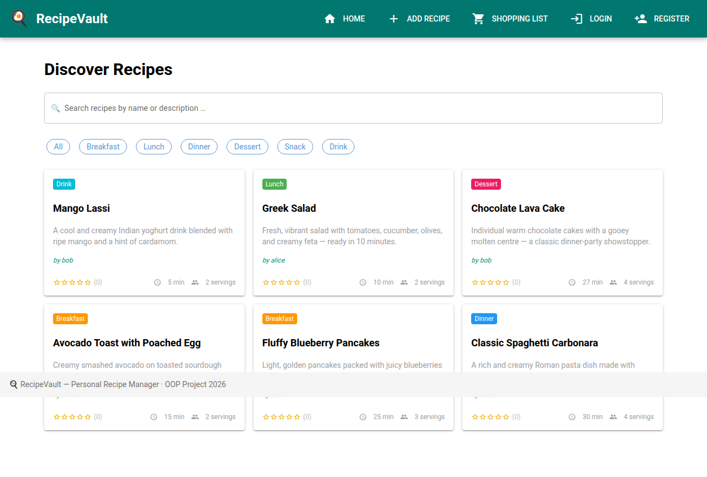
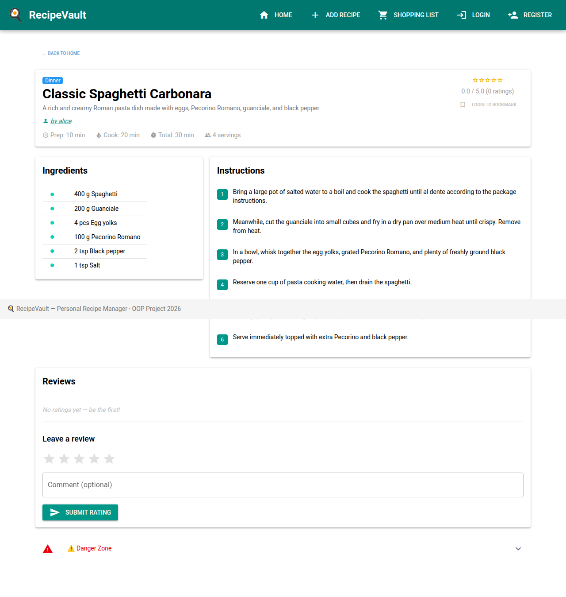
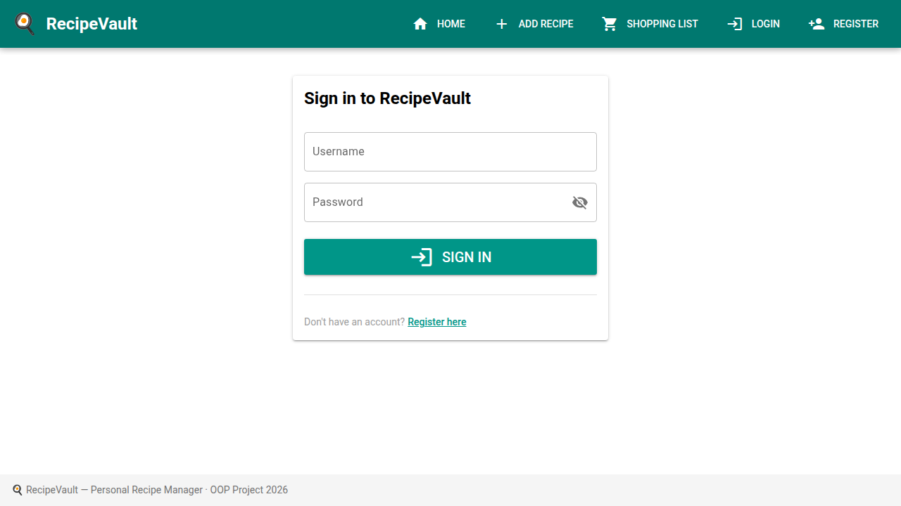
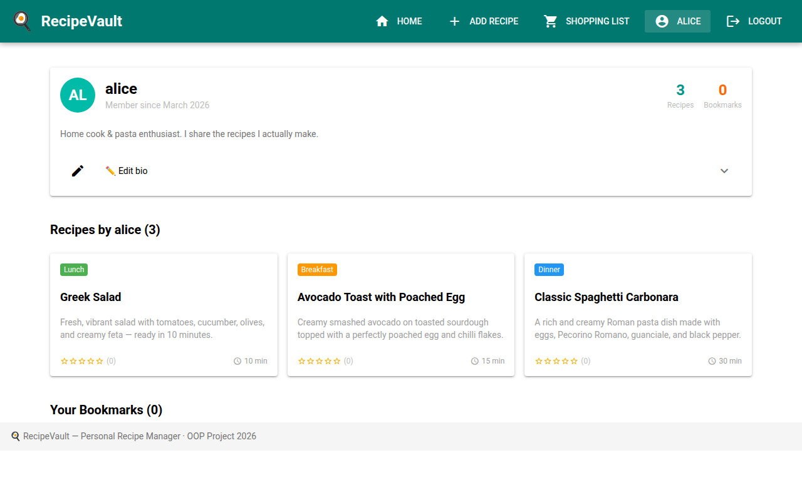

# 🍳 RecipeVault — Personal Recipe Manager

> **BSc WI — Objektorientierte Programmierung 1 · Group Project 2026**

A browser-based **personal recipe management platform** built with **NiceGUI**, **SQLAlchemy** (ORM), and **SQLite**.  
Users create their own account, share recipes they've authored, bookmark favourites from others, and build a personal cooking profile — all backed by a clean three-layer OOP architecture.

---

## Why RecipeVault?

Generic recipe websites give you thousands of recipes, but not *yours*.  
RecipeVault solves a real problem: **keeping your own recipes in one place, accessible from any browser, attributed to you**, and enriched with community ratings.  
Think of it as a lightweight personal Allrecipes — where every recipe has an owner, and every user has a profile that grows over time.

---

## 📸 Screenshots

| Home — Recipe Grid | Recipe Detail |
|---|---|
|  |  |

| Login | User Profile |
|---|---|
|  |  |

---

## ✨ Features

| Feature | Description |
|---|---|
| 👤 **User accounts** | Register with username + email + password; securely hashed (PBKDF2-HMAC-SHA256) |
| 🔐 **Login / Logout** | Session stored in encrypted browser cookie via NiceGUI storage |
| 📋 **Profile page** | Public profile for every user — shows authored recipes, bio, member since |
| 🔖 **Bookmarks** | Logged-in users can bookmark any recipe; bookmarks appear on their profile |
| ✍️ **Recipe authorship** | Every recipe is attributed to the user who created it; clickable author link |
| 🔍 **Search** | Live search by recipe title or description |
| 🏷️ **Category filter** | Filter by Breakfast, Lunch, Dinner, Dessert, Snack, or Drink |
| 🍳 **Recipe detail** | Full ingredients list + numbered step-by-step instructions |
| ⭐ **Star ratings** | Submit a 1–5 star review with an optional comment |
| ➕ **Add recipe** | Dynamic form with add/remove ingredient rows and instruction steps |
| 🛒 **Shopping list** | Select multiple recipes; ingredients are aggregated by name + unit |
| 🗑️ **Delete recipe** | Remove a recipe and all its related data |

---

## 🏗️ Architecture

The application follows the three-layer architecture required by the module:

```
┌────────────────────────────────────────────────────┐
│  Presentation Layer (Thin Client)                  │
│  Browser — renders Vue.js / Quasar components      │
└──────────────────────┬─────────────────────────────┘
                       │  WebSocket (NiceGUI)
┌──────────────────────▼─────────────────────────────┐
│  Application Logic (Server-side Frontend)          │
│  NiceGUI pages + Python OOP service classes        │
│  app/views/   <->   app/services/                  │
└──────────────────────┬─────────────────────────────┘
                       │  SQLAlchemy ORM
┌──────────────────────▼─────────────────────────────┐
│  Persistence Layer                                 │
│  SQLite database  ·  app/models/                   │
└────────────────────────────────────────────────────┘
```

### Project structure

```
Advanced-Programming/
├── main.py                  # Entry point – starts NiceGUI server
├── requirements.txt         # Python dependencies
├── app/
│   ├── models/
│   │   ├── database.py      # SQLAlchemy engine, session factory, Base
│   │   ├── user.py          # User model + password hashing helpers
│   │   ├── bookmark.py      # Bookmark model (user ↔ recipe many-to-many)
│   │   ├── recipe.py        # Recipe model + Category enum
│   │   ├── ingredient.py    # Ingredient model (belongs to Recipe)
│   │   ├── step.py          # Step model (ordered instructions)
│   │   └── rating.py        # Rating model (1–5 stars + comment)
│   ├── services/
│   │   ├── user_service.py    # Register, authenticate, profile, bookmarks
│   │   ├── recipe_service.py  # CRUD + search for recipes
│   │   └── rating_service.py  # Submit + read ratings
│   ├── views/
│   │   ├── shared.py          # Reusable: auth-aware header/footer, star display
│   │   ├── auth.py            # /login, /register, /logout + session helpers
│   │   ├── profile.py         # /profile, /profile/{username}
│   │   ├── home.py            # "/" — recipe grid with search & filter
│   │   ├── recipe_detail.py   # "/recipe/{id}" — full recipe + bookmark
│   │   ├── add_recipe.py      # "/add" — dynamic add-recipe form
│   │   └── shopping_list.py   # "/shopping" — ingredient aggregator
│   └── seed.py              # Demo users + sample recipes on first run
└── readme.md
```

---

## 🗄️ Data Model

```
User
  ├── id, username, email, password_hash, bio, created_at
  ├── ── Recipe   (authored recipes)       [1 → *]
  └── ── Bookmark (saved recipe refs)      [1 → *]

Recipe
  ├── id, title, description, category, servings
  ├── prep_time, cook_time, created_at
  ├── user_id  (FK → User, nullable)
  ├── ── Ingredient (name, amount, unit)   [1 → *]
  ├── ── Step       (number, description)  [1 → *]
  ├── ── Rating     (score 1–5, comment)   [1 → *]
  └── ── Bookmark   (back-refs)            [1 → *]

Bookmark
  ├── id, user_id (FK), recipe_id (FK), created_at
  └── UNIQUE(user_id, recipe_id)
```

All relationships use **cascade delete** where appropriate.

---

## 📚 Libraries Used

| Library | Version | Purpose |
|---|---|---|
| [NiceGUI](https://nicegui.io/) | >= 2.0 | Browser-based UI built in pure Python (Vue.js + Quasar under the hood) |
| [SQLAlchemy](https://www.sqlalchemy.org/) | >= 2.0 | ORM — no raw SQL; all queries go through Python model classes |
| SQLite (stdlib) | — | Embedded database; no external server required |
| hashlib (stdlib) | — | PBKDF2-HMAC-SHA256 password hashing; no extra dependency |

---

## 🚀 Getting Started

### 1. Install dependencies

```bash
pip install -r requirements.txt
```

### 2. Run the application

```bash
python main.py
```

The server starts at **http://localhost:8080**.  
On the first run the database is created and seeded with **2 demo users** and **6 sample recipes** automatically.

### Demo accounts

| Username | Password | Recipes |
|---|---|---|
| `alice` | `alice123` | Spaghetti Carbonara, Avocado Toast, Greek Salad |
| `bob` | `bob12345` | Blueberry Pancakes, Chocolate Lava Cake, Mango Lassi |

---

## 👤 User Stories

| ID | As a … | I want to … | So that … |
|---|---|---|---|
| US-1 | visitor | register an account | I have a personal space on the platform |
| US-2 | visitor | log in with my username and password | I can access my profile and bookmarks |
| US-3 | user | view my profile page | I can see all my recipes and bookmarked favourites |
| US-4 | user | edit my bio | I can tell the community about myself |
| US-5 | user | add a new recipe | It is attributed to my account and visible on my profile |
| US-6 | user | bookmark a recipe | I can save recipes I want to cook later |
| US-7 | user | remove a bookmark | I can keep my collection up to date |
| US-8 | visitor | browse all recipes on the home page | I can discover what others have shared |
| US-9 | visitor | filter recipes by category | I only see recipes relevant to the meal I'm planning |
| US-10 | visitor | click on an author's name | I can see their profile and other recipes |
| US-11 | user | submit a star rating and comment | I can share feedback with other users |
| US-12 | user | generate a shopping list | I can do one combined grocery run for multiple recipes |

---

## 📐 Use Cases

### UC-1: Register & Login
- **Actor**: New visitor
- **Flow**: Click "Register" → fill username / email / password / bio → account created and logged in → redirected to home

### UC-2: View & Edit Profile
- **Actor**: Logged-in user
- **Flow**: Click username in header → `/profile/<username>` shows authored recipes + bookmarks; expand "Edit bio" section to update bio

### UC-3: Bookmark a Recipe
- **Actor**: Logged-in user
- **Flow**: Open any recipe detail page → click "Bookmark" button → bookmark saved; button updates; recipe now appears in profile bookmarks

### UC-4: Add an Authored Recipe
- **Actor**: Logged-in user
- **Flow**: Click "Add Recipe" in the nav → fill form → "Save Recipe" → new recipe appears in the grid attributed to the user

### UC-5: Browse & Filter Recipes
- **Actor**: Any visitor
- **Flow**: Open `/` → optionally search → click a category chip → grid updates live; author name shown on each card

### UC-6: Generate a Shopping List
- **Actor**: Any user
- **Flow**: Navigate to `/shopping` → check one or more recipes → "Generate List" → combined ingredient list displayed

---

## 👥 Team & Work Distribution

| Member | Responsibility |
|---|---|
| Member 1 | Data models (`app/models/`): User, Bookmark, Recipe + relationships; database setup; seed data |
| Member 2 | Service layer (`app/services/`): UserService (auth, profile, bookmarks), RecipeService, RatingService |
| Member 3 | NiceGUI views (`app/views/`): auth pages, profile page, updated shared layout, README |

> Every member commits independently to this repository. GitHub commit history reflects individual contributions.

---

## 🗓️ Milestones

| Milestone | Target | Status |
|---|---|---|
| Project setup & data models | Week 3 | ✅ |
| Service layer & CRUD operations | Week 5 | ✅ |
| NiceGUI views (home, detail, add) | Week 8 | ✅ |
| Shopping list & ratings | Week 10 | ✅ |
| User auth, profiles & bookmarks | Week 11 | ✅ |
| Final polish & README | Week 12 | ✅ |
| Presentation | Last week | �� |
